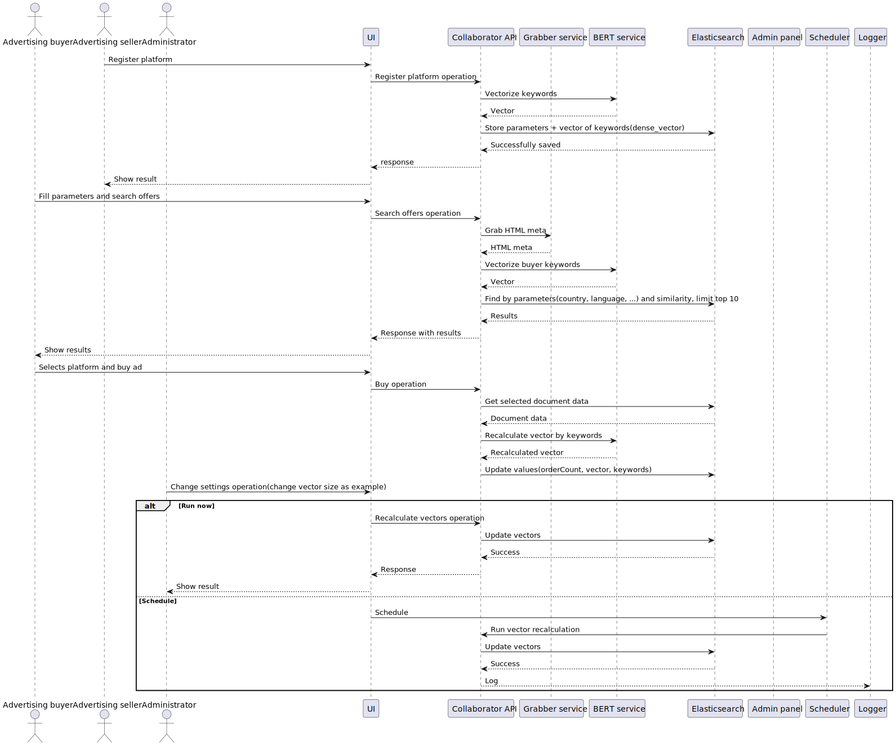

# Collaborator-pro

## UML Diagram:

## Code Examples:
- [BERT Vectorizer Service](./doc/examples/bert.py)
- [Get/Search Service](./doc/examples/elastic_set.py)
- [Create/Update Service](./doc/examples/elastic_get.py)

## Suggested Technology Stack:

### API Services:
**Python** — chosen for its robust ecosystem of AI/ML libraries (e.g., Hugging Face Transformers, PyTorch) and frameworks like FastAPI for building scalable APIs.

### Vectorizer:
**BERT** — leverages pre-trained multilingual models (e.g., `bert-base-multilingual-cased`) for semantic understanding of phrases and context-aware embeddings.

### Storage:
**Elasticsearch 7.3+** — provides:
- Native support for dense vector search (`dense_vector` field type).
- Advanced filtering, aggregation, and sorting capabilities.
- Integrated monitoring via Kibana and APM.
- Scalability through distributed architecture.  
  *Consider the [Elastiknn plugin](https://github.com/alexklibisz/elastiknn) for approximate nearest neighbor (ANN) search optimizations.*

### UI:
**React** — offers a component-based architecture, extensive community support, and compatibility with modern tools (e.g., Redux, Material-UI) for maintainable frontend development.

### Scheduler:
- **Cron** for recurring tasks.
- **at** for one-time jobs.  
  *Alternatives: Celery (distributed tasks) or Airflow (workflow orchestration).*

### Environment:
**AWS** (or alternatives like GCP/Azure) — ensures scalability, managed security (IAM, VPC), and serverless integration (Lambda, Fargate).